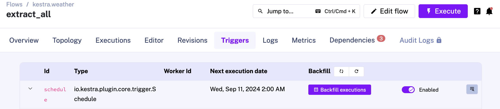

# ELT Project with Kestra

This repository is a self-contained project exploring a full ELT project using Kestra, dbt, DuckDB, Neon Postgres and Resend. 

## Requirements

* [Docker](https://docs.docker.com/engine/install/) & [Docker Compose](https://docs.docker.com/compose/install/)
* [Terraform](https://developer.hashicorp.com/terraform/tutorials/aws-get-started/install-cli)

## Setup

1️⃣ Get a Neon Serverless Postgres API key: create a [Neon account](https://neon.tech/) and go to [Account Settings > API Keys](https://console.neon.tech/app/settings/api-keys)

2️⃣ Get a Resent API key: create a [Resend account](https://resend.com/) and go to [API keys](https://resend.com/api-keys).

3️⃣ Run Kestra: `docker-compose up -d` and open your web browser at http://localhost:8080, you should see the Kestra UI.

4️⃣ Deploy all resources with Terraform:
* `terraform init`
* `terraform plan` to check all the resources that will be deployed (Neon project and Kestra flows).
* `terraform apply`

5️⃣ Fill a `.env` file (you can see an example in the `.env.template`). All values should be encoded in base64. You can find more information in [Kestra Secret documentation](https://kestra.io/docs/concepts/secret). You can find all Postgres information into your Neon account where a new project has been deployed with Terraform (project should be `kestra_elt` and database branch is `prod`).

6️⃣ Restart the Kestra instance configuraiton is updated.

## Run backfill

Once everything is deployed you can go to the `kestra.weather` namespace and the `extract_all` flow and go to Trigger tab and click on "Backfill executions". From there you can pass start and end dates and run the pipelines for previous dates.

